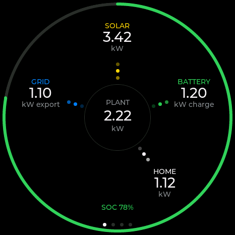
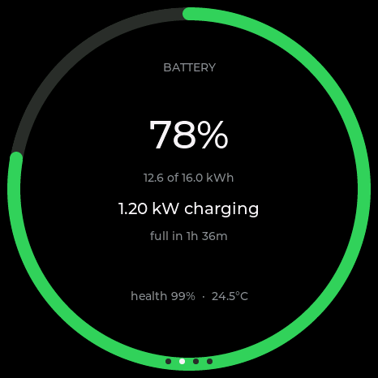
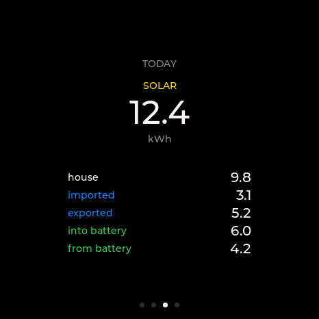
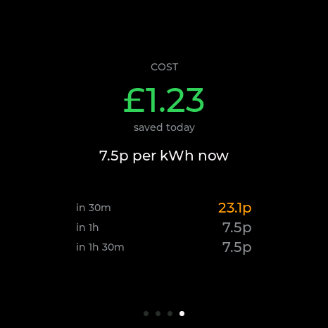
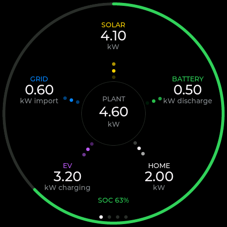

# SigenStorPuck

A round touchscreen status display for a [SigenStor Display](https://github.com/markab/SigenStorDisplay)
solar and battery installation.

It runs on a Waveshare **ESP32-S3-Touch-AMOLED-1.75** — a 466×466 round AMOLED with
capacitive touch — and shows live power flow, battery state, today's energy totals and
tariff costs. Swipe between the four screens.

## The screens

| | |
|:--:|:--:|
|  |  |
| **Power flow.** Solar at the top, then clockwise: battery, home, EV, grid, around the plant in the middle. Dots run along each leg in the direction power is actually flowing, faster when more of it is. | **Battery.** State of charge around the bezel, what it is doing right now, and how long until it is full or empty. |
|  |  |
| **Today.** Generation as the headline, then where it went — the house, the grid, the battery. | **Cost.** Today's saving, the rate you are paying now, and the next few tariff slots coloured against it. |

The EV leg only appears when something is charging, so nothing moves around when it isn't:

<p align="center"></p>

## Installing

### → [Install SigenStorPuck](https://markab.github.io/SigenStorPuck/)

1. Plug the Puck into a computer and open the link above in **Chrome or Edge**. It
   flashes over WebSerial — nothing to download, no drivers. Safari and Firefox cannot
   do it, and neither can anything on iOS.
2. On first boot it raises a WiFi access point named after the device, like
   `SigenStorPuck-DB41E4`. The screen shows which one. Join it, pick your network, and —
   if this is your second Puck — give it a name of its own while you are there.
3. Open `http://sigenstorpuck.local/`, or the IP address shown on the screen, and paste
   the enrolment URL from SigenStor Display's **Admin → Kiosk devices**.

After that it updates itself from releases.

## How it works

The Puck is a renderer, not a calculator. It polls one small endpoint:

```
GET /api/summary
```

which returns about 400 bytes of already-derived numbers — house load, battery state,
today's totals, savings, upcoming unit rates. All the arithmetic stays on the server
where it is tested; the firmware just draws.

The same build works against a Raspberry Pi on the LAN over plain HTTP or a public VPS
over HTTPS, with certificates validated. Authentication uses the server's existing
read-only **kiosk token**, which is long-lived and revocable from the Admin page.

## Building it yourself

```bash
pio run -e puck -t upload -t monitor
```

Screens are developed against canned payloads on the desktop rather than by reflashing,
which is what every screenshot above came from:

```bash
pio run -e sim && .pio/build/sim/program
```

`n`/`p` change fixture, `[`/`]` change screen, `d` shows the parsed data behind what you
are looking at.

## Hardware

| | |
|---|---|
| Board | Waveshare ESP32-S3-Touch-AMOLED-1.75 |
| Display | 466×466 round AMOLED, CO5300 over QSPI |
| Touch | CST9217, I2C |
| MCU | ESP32-S3R8, 8 MB PSRAM, 16 MB flash |
| Also on board | AXP2101 PMIC, PCF85063 RTC, QMI8658 IMU |
