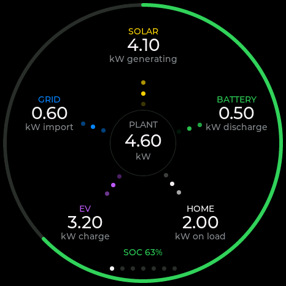
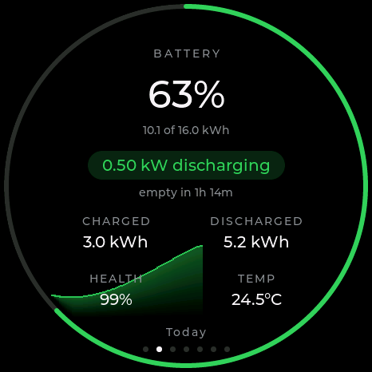
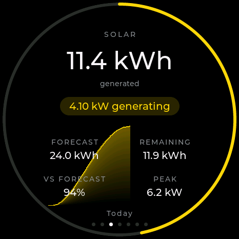
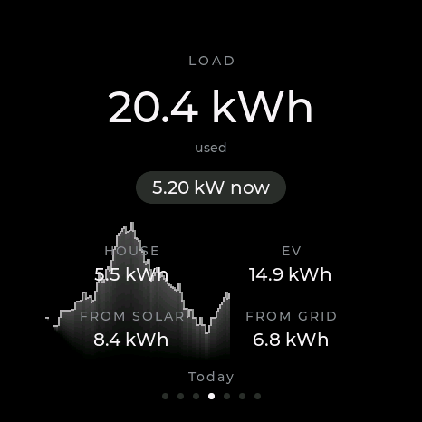
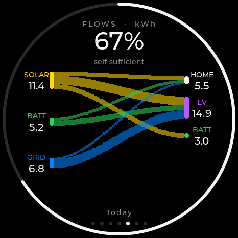
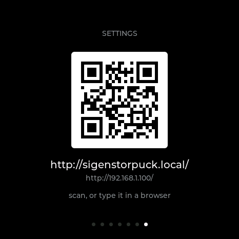

# SigenStorPuck

A round touchscreen status display for a Sigenergy SigenStor solar and battery system.

It runs on a Waveshare **ESP32-S3-Touch-AMOLED-1.75** — a 466×466 round AMOLED with
capacitive touch — and shows live power flow, battery state, solar generation against
forecast, consumption, where the day's energy went, and what it all cost.

It can get its data two ways:

- from a [SigenStor Display](https://github.com/markab/SigenStorDisplay) server, which
  gives you every screen; or
- **straight from the plant over Modbus TCP**, with no server involved, which gives you
  the power, battery, solar and load screens.

## The screens

Swipe left and right to move between them. Which ones appear is up to you — see
**Screens** under Settings.

| | |
|:--:|:--:|
|  |  |
| **Power** — what is happening right now. Solar at the top, then clockwise: battery, home, EV, grid, around the plant in the middle. Dots run along each leg in the direction the power is going, faster when there is more of it. The ring is your state of charge. | **Battery** — charge level around the bezel, capacity in kWh, and how long until it is full or empty. Below that: charged and discharged today, battery health, and temperature. |
|  |  |
| **Solar** — generation so far today, with the ring showing progress against the day's forecast. Then the forecast total, how much is still to come, how you are doing against it, and the expected peak. | **Load** — everything used today, with what is being drawn right now. Split into the house and the car, then how much came from solar and how much from the grid. |
|  |  |
| **Flows** — where today's energy came from and where it went. Sources down the left, destinations down the right, one ribbon per path. The ring is how self-sufficient you have been. *(Server only.)* | **Cost** — what you have saved today, the unit rate you are paying right now, and the next few tariff slots coloured against it. *(Server only.)* |
|  | |
| **Settings** — always the last screen. Scan the code with your phone, or type either address into a browser, to reach the settings page. | |

Behind the solar, load and battery screens is that day's own curve, drawn faintly so it
does not compete with the figures.

### The two buttons

| | Press | Hold 2 seconds | Hold 5 seconds |
|---|---|---|---|
| **PWR** | Back one day | Auto-cycle on/off | Power off |
| **BOOT** | Forward one day | Next screen | Restart |

You can step back up to seven days. The Power screen always stays live, and the day you
are looking at is named just above the page dots. Stepping through days needs a server —
on Modbus the buttons say `LIVE ONLY`.

If the screen is off on a schedule, the first press of any button just wakes it up.

## Installing

### 1. Flash the firmware

Plug the Puck into a computer with a USB-C cable and open this page in **Chrome or Edge**:

### → [Install SigenStorPuck](https://markab.github.io/SigenStorPuck/)

It flashes over WebSerial — nothing to download and no drivers to install. Safari and
Firefox cannot do this, and neither can anything on an iPhone or iPad.

After the first flash the Puck updates itself — see **Firmware** below.

### 2. Join it to your WiFi

On first boot the screen shows:

> **WiFi setup**
> Join the WiFi network
> SigenStorPuck-A1B2C3

The last part is that Puck's own name, different on every device.

1. On your phone or laptop, join that WiFi network. A setup page opens by itself; if it
   does not, browse to `http://192.168.4.1/`.
2. Tap **Configure WiFi**, pick your home network and enter its password.
3. If this is your second Puck, give it a **device name** on the same page so the two do
   not clash.
4. Save. The Puck joins your network and the screen changes to **Not configured**.

### 3. Tell it where to get data

The **Not configured** screen shows a QR code and the address of the Puck's settings
page — both the friendly name and the IP address, because not every phone can resolve
`.local` names.

**Scan the QR code with your phone**, or type either address into any browser on the
same network:

```
http://sigenstorpuck.local/
```

Then, depending on how you want to connect:

**Using a SigenStor Display server** — open your server's **Admin → Kiosk devices** page,
create a device, and copy the enrolment URL it gives you. Paste it into the **Server**
section of the Puck's settings page and save. That is everything: the URL carries the
server address and the access token together.

**Straight from the plant over Modbus** — set **Data source** to *Plant over Modbus*,
enter your inverter or gateway's IP address under **Plant (Modbus)**, and restart. In the
Sigen app you must also allow Modbus TCP access for the Puck's IP address, and it is
worth giving the Puck a fixed address in your router so that permission does not stop
working later.

Data should appear within a few seconds.

## Settings

Everything below lives on the Puck's own settings page at `http://sigenstorpuck.local/`.
Most changes take effect straight away; the ones that need a restart say so.

### Network

**Device name** — what the Puck calls itself on your network. The default is
`sigenstorpuck`, reachable at `http://sigenstorpuck.local/`. Change it if you have more
than one. *Needs a restart.*

### Data source

**Server** or **Plant over Modbus**. Choosing Modbus removes the Flows and Cost screens,
which need information only a server has. *Needs a restart.*

### Server

**Enrolment URL** — paste the whole URL from your server's Admin → Kiosk devices page and
it fills in the address and access token for you. The page shows the last four characters
of the stored token so you can tell one device's enrolment from another's.

**Test connection** — fetches data once and tells you exactly what happened, which is the
quickest way to find a wrong address or a revoked token.

### Plant (Modbus)

**Gateway or inverter IP** — the address of the device on your network that speaks Modbus
TCP. **Port** is 502 unless you have changed it, and **Plant address** is 247.

**Devices** — optional. The plant address on its own already fills the power and battery
screens. Add an inverter to get battery temperature and daily totals, or a charger to get
EV power. Leave the Slave ID at 0 for any slot you are not using. Tick **DC charger** if
your inverter has a vehicle charger built into it.

### Solar forecast

Only used on the Modbus source — with a server, the forecast comes from there.

**Latitude and longitude** — where your panels are. Leave both blank for no forecast, and
the Solar screen simply hides its ring. Setting a location also gives the Puck your
timezone, which is what lines the daily charts up with your own midnight.

**System loss** — everything between the panels' rating and your meter: inverter
efficiency, wiring, dirt on the glass. `0.85` is a sensible default.

**Inverter cap** — the most your inverter can put out, in kW. `0` means no limit.

**Arrays** — up to four. **Size** is the array's rating in kWp; leave it at 0 for a slot
you are not using. **Tilt** is the angle from flat, so 0 is horizontal and 35 is a
typical pitched roof. **Azimuth** is a compass bearing: 180 is due south, 90 east, 270
west.

### Display

**Brightness** — 0 to 255, normal running brightness.

**Poll interval** — how often to fetch new data, in seconds. 5 is the default.

**Dim after** — seconds of no touching before the screen dims. `0` never dims.

**Dimmed brightness** — how dim it goes. It dims rather than blanking, so it stays
readable across the room.

**Screen off from / until** — hours to switch the screen off completely, for overnight.
Off means off, not dimmed. Any button brings it back for 30 seconds. Blank both boxes to
leave the screen on all the time. The times are the Puck's local time, which the page
shows next to the boxes so you can check it is right.

**Orientation** — quarter turns, 0 to 3, for mounting the Puck whichever way round suits.
*Needs a restart.*

**Auto-cycle every** — seconds between automatically moving to the next screen. `0` turns
it off. Also switchable by holding PWR for 2 seconds.

**Sweep every** — minutes between a brightness band sweeping across the screen. This
evens out wear on the panel, which matters on an AMOLED showing much the same picture all
day. `0` turns it off.

**Screens** — a tick per screen for whether it appears at all, and a second for whether
the auto-cycle stops on it. Power and Settings are always shown. *Needs a restart.*

### Firmware

Shows the version you are running. If a newer release is available, **Install**
downloads and applies it and the Puck restarts on its own. **Check now** looks again
straight away.

Untick **Check for a newer release when this page is opened** to stop it contacting
GitHub at all. Installing an update is always something you ask for, never automatic.

### Danger

**Restart Device** — reboots it.

**Forget server and token** — clears your server details. You will need the enrolment URL
again.

**Forget WiFi and restart** — clears the WiFi password and brings the setup network back,
for moving the Puck to a different network.

## Troubleshooting

| On screen | What it means |
|---|---|
| **WiFi setup** | Not on your network yet. Join the setup network shown and follow step 2. |
| **Connecting to WiFi** | Joining your network. It should pass in a few seconds. |
| **Not configured** | On WiFi, but it does not know where to get data. Follow step 3. |
| **Waiting for data** | Configured, but nothing has arrived yet. Normal just after a restart. |
| **Waiting for clock** | It needs the time from the internet before it can make a secure connection. Passes on its own once your network lets it reach an NTP server. |
| **Re-enrol needed** | The access token has been revoked. Create a new kiosk device on the server and paste the fresh enrolment URL. |
| **No data** | It cannot reach the server or the plant, and names the reason underneath. Check the address on the settings page and use **Test connection**. |
| `LIVE ONLY` | You pressed a day button on the Modbus source, which has no history to step back into. |

If a Modbus setup worked and then stopped, check that the Puck still has the same IP
address and that it is still allowed in the Sigen app.

## Hardware

| | |
|---|---|
| Board | Waveshare ESP32-S3-Touch-AMOLED-1.75 |
| Display | 466×466 round AMOLED, CO5300 over QSPI |
| Touch | CST9217, I2C |
| MCU | ESP32-S3R8, 8 MB PSRAM, 16 MB flash |
| Also on board | AXP2101 PMIC, PCF85063 RTC, QMI8658 IMU |

## Building it yourself

```bash
pio run -e puck -t upload -t monitor
```

Screens are developed against canned payloads on the desktop rather than by reflashing,
which is where every screenshot above came from:

```bash
pio run -e sim && .pio/build/sim/program
```

`n`/`p` change fixture, `[`/`]` change screen, `d` shows the parsed data behind what you
are looking at.

Design notes and the reasoning behind how it is built are in
[CLAUDE.md](CLAUDE.md) and [docs/PLAN.md](docs/PLAN.md).
